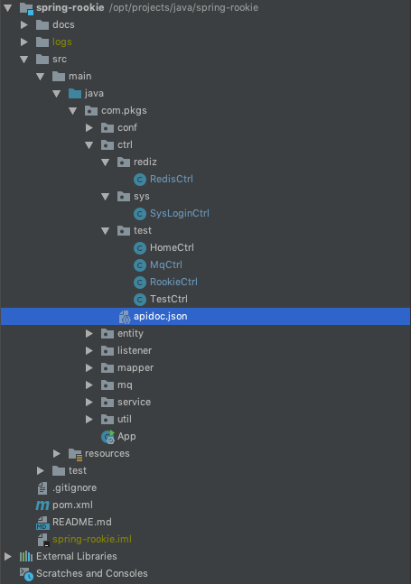
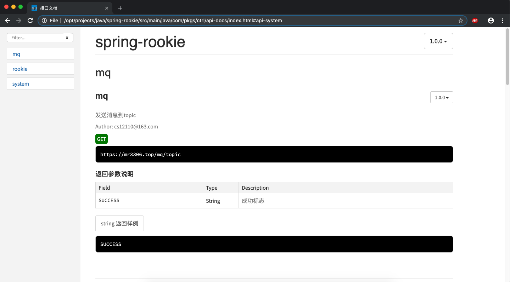

# apidoc

在项目里面写好了接口,怎么能给别人看懂,怎么提高阅读性也是一门艺术呀.

如果需要好的接口文档,apidoc 是一个不错的选择.

---

## 1. 安装 apidoc

因为 apidoc 安装依赖 nodejs,这里面不叙述 nodejs 怎么安装了,因为只要在官网里面的下载相应的安装包,安装即可.

安装 nodejs 完成之后,使用命令查看是否安装完成.

```sh
mr3306:test mr3306$ node -v
v10.16.0
mr3306:test mr3306$
```

好的,现在安装完成 nodejs 之后,我们可以安装 apidoc 了.安装会出现权限问题(osx),建议切换为更高级的用户安装,如 root.

```sh
mr3306:test mr3306$npm install -g apidoc
```

---

## 2. 使用教程

Q: 那我们要怎么使用呀?

A: follow me.

因为用于说明接口,所以我们只要在 controller 层的接口加上 apidoc 相应的注释,然后使用 apidoc 生成文档即可.

### 2.1 apidoc.json

apidoc 主要说明项目.

```json
{
  "name": "spring-rookie",
  "version": "1.0.0",
  "title": "接口文档",
  "url": "https://mr3306.top"
}
```

### 2.2 注释样例

现在项目结构如下图所示.



注释示例如下:

```java
/**
* @apiDescription test param interface of controller
* <p>
* Author: cs12110@163.com
* @api {get} /rookie/param
* @apiName param
* @apiGroup rookie
* @apiVersion 1.0.0
* @apiParam {String} name 用户昵称
* @apiParam {String} password 用户密码
* @apiSuccess (返回参数说明) {String} name 用户名称
* @apiSuccess (返回参数说明) {String} password 用户密码
* @apiSuccess (返回参数说明) {String} timestamp 时间戳
* @apiSuccessExample jsonp 返回样例
* {
* "name":"haiyan",
* "password":"123456",
* "timestamp":"2019-06-06 19:02:00"
* }
*/
@RequestMapping("/param")
@ResponseBody
public Object param(@RequestParam("name") String name, @RequestParam("password") String password) {

    log.info(name + ":" + password);


    Map<String, Object> map = new HashMap<>();
    map.put("name", name);
    map.put("password", password);
    map.put("timestamp", System.currentTimeMillis());


    return map;
}
```

各个注释参数含义,请参考[apidoc 官方文档](http://apidocjs.com/)

---

## 3. 生成接口文档

### 3.1 生成接口文档

注意:**每一次生成新的接口文档都是全量覆盖**

生成命令: `apidoc -i yourControllerFolderPath -o docsPath`

参数含义:

- i 带有 apidoc.json 文件的 controller 文件夹路径
- o 输出文档的路径,会自动创建

```sh
# 项目路径
mr3306:ctrl mr3306$ pwd
/opt/projects/java/spring-rookie/src/main/java/com/pkgs/ctrl

# package结构
mr3306:ctrl mr3306$ ls
api-docs	apidoc.json	rediz		sys		test

# 在当前文件夹生成api文档
mr3306:ctrl mr3306$ apidoc -i .  -o api-docs/
```

Q: 如果只想生成某一个类的 api 接口文档,而不是整一个 package 的呢?

A: 可以使用 `-f`来正则匹配文件来生成.

```ssh
mr3306:ctrl mr3306$ apidoc -f 'MyController.java' -i . -o d:/apidoc
```

### 3.2 查看接口文档

在上面的命令生成文件夹之后,里面有一个`index.html`文件,使用浏览器打开这个 index.html 文件即可.



---

## 4. 参考文档

a. [apidoc 官网](http://apidocjs.com/)
