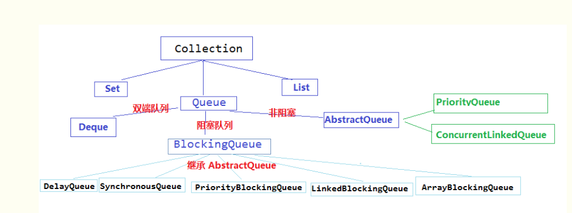

# Queue 的使用

在生产环境里面有一个需求,就是日志的异步写出,不影响接口的响应速度.

那么可以自己设计一个简单的 Mq,这样子就可以用到队列.

---

## 1. Queue 基础

### 1.1 继承架构

Java 的 Queue 接口集成实现图[来源](https://www.cnblogs.com/lemon-flm/p/7877898.html)



**不阻塞接口的 LinkedList**

实现了 java.util.Queue 接口和 java.util.AbstractQueue 接口
内置的不阻塞队列: PriorityQueue 和 ConcurrentLinkedQueue
PriorityQueue 和 ConcurrentLinkedQueue 类在 Collection Framework 中加入两个具体集合实现.
PriorityQueue 类实质上维护了一个有序列表.加入到 Queue 中的元素根据它们的天然排序（通过其 java.util.Comparable 实现）或者根据传递给构造函数的 java.util.Comparator 实现来定位.
ConcurrentLinkedQueue 是基于链接节点的,线程安全的队列.并发访问不需要同步.因为它在队列的尾部添加元素并从头部删除它们,所以只要不需要知道队列的大 小,ConcurrentLinkedQueue 对公共集合的共享访问就可以工作得很好.收集关于队列大小的信息会很慢,需要遍历队列.

**实现阻塞接口**

java.util.concurrent 中加入了 BlockingQueue 接口和五个阻塞队列类.它实质上就是一种带有一点扭曲的 FIFO 数据结构.不是立即从队列中添加或者删除元素,线程执行操作阻塞,直到有空间或者元素可用.

五个队列所提供的各有不同:

- ArrayBlockingQueue: 一个由数组支持的有界队列.
- LinkedBlockingQueue: 一个由链接节点支持的可选有界队列.
- PriorityBlockingQueue: 一个由优先级堆支持的无界优先级队列.
- DelayQueue: 一个由优先级堆支持的,基于时间的调度队列.
- SynchronousQueue: 一个利用 BlockingQueue 接口的简单聚集(rendezvous)机制.

  ​

### 1.2 方法说明

| 方法    | 功能描述                 | 详细描述                                            |
| ------- | ------------------------ | --------------------------------------------------- |
| add     | 增加一个元索             | 如果队列已满,则抛出一个 IIIegaISlabEepeplian 异常   |
| remove  | 移除并返回队列头部的元素 | 如果队列为空,则抛出一个 NoSuchElementException 异常 |
| element | 返回队列头部的元素       | 如果队列为空,则抛出一个 NoSuchElementException 异常 |
| offer   | 添加一个元素并返回 true  | 如果队列已满,则返回 false                           |
| poll    | 移除并返问队列头部的元素 | 如果队列为空,则返回 null                            |
| peek    | 返回队列头部的元素       | 如果队列为空,则返回 null                            |
| put     | 添加一个元素             | 如果队列满,则阻塞                                   |
| take    | 移除并返回队列头部的元素 | 如果队列为空,则阻塞                                 |

## 2. 简单代码

面临问题: 如消息堆积,该怎么办?这个可能会把服务器给撑爆了.(还没想到好的解决方法,可以给消息队列设置 size 大小,当大于某个值的时候,开始丢弃,如果业务允许的话)

```java
import java.util.LinkedList;
import java.util.Queue;

/**
 *
 * Just simple MQ
 *
 * @author root
 *
 */
public class TinyMQ {

	/**
	 * Message queue
	 */
	private static Queue<String> queue = new LinkedList<>();

	/**
	 * size of queue
	 */
	private static volatile int size = 0;

	/**
	 * Add msg to queue
	 *
	 * @param msg msg
	 * @return boolean if add msg to queue successful
	 */
	public static boolean put(String msg) {
		synchronized (TinyMQ.class) {
			size++;
			return queue.offer(msg);
		}
	}

	/**
	 * Take the first msg of queue, and remove it from queue
	 *
	 * @return String
	 */
	public static String take() {
		synchronized (TinyMQ.class) {
			String value = queue.poll();
			if (value != null) {
				size--;
			}
			return value;
		}
	}

	/**
	 * if queue is empty ,return true
	 *
	 * @return boolean
	 */
	public static boolean isEmpty() {
		synchronized (TinyMQ.class) {
			return queue.size() == 0;
		}
	}

	/**
	 * return the size of queue
	 *
	 * @return int
	 */
	public static int size() {
		return size;
	}

}
```

---

## 3. 测试

### 3.1 测试代码

```java
import java.text.SimpleDateFormat;
import java.util.Date;

public class TinyMQTest2 {

	public static void main(String[] args) {
		try {
			Thread producer1 = new Thread(new MqProducer("p1"));
			Thread producer2 = new Thread(new MqProducer("p2"));
			Thread t1 = new Thread(new MqConsumer("t1"));

			producer1.start();
			producer2.start();

			t1.start();
		} catch (Exception e) {
			e.printStackTrace();
		}
	}

	static class MqProducer implements Runnable {

		private String threadName;

		public MqProducer(String threadName) {
			super();
			this.threadName = threadName;
		}

		@Override
		public void run() {
			try {
				while (true) {
					long timestamp = System.currentTimeMillis();
					TinyMQ.put(threadName + " msg" + timestamp);
					Thread.sleep(2000);
				}

			} catch (Exception e) {
				e.printStackTrace();
			}
		}
	}

	static class MqConsumer implements Runnable {
		private String threadName;

		public MqConsumer(String threadName) {
			super();
			this.threadName = threadName;
		}

		@Override
		public void run() {
			while (true) {
				if (TinyMQ.isEmpty()) {
					try {
						Thread.sleep(500);
					} catch (Exception e) {
						e.printStackTrace();
					}
				} else {
					SimpleDateFormat sdf = new SimpleDateFormat("yyyy-MM-dd HH:mm:ss");
					StringBuilder body = new StringBuilder();
					body.append(sdf.format(new Date()));
					body.append(" ");
					body.append(threadName);
					body.append(" {");
					body.append(TinyMQ.take());
					body.append("} [");
					body.append(TinyMQ.size());
					body.append("]");
					System.out.println(body);
				}
			}

		}

	}
}
```

### 3.2 测试结果

```java
2018-10-21 15:35:03 t1 {p2 msg1540107303847} [1]
2018-10-21 15:35:03 t1 {p1 msg1540107303848} [0]
2018-10-21 15:35:05 t1 {p2 msg1540107305855} [1]
2018-10-21 15:35:05 t1 {p1 msg1540107305855} [0]
2018-10-21 15:35:07 t1 {p2 msg1540107307855} [1]
2018-10-21 15:35:07 t1 {p1 msg1540107307855} [0]
2018-10-21 15:35:09 t1 {p1 msg1540107309856} [1]
2018-10-21 15:35:09 t1 {p2 msg1540107309856} [0]
2018-10-21 15:35:11 t1 {p1 msg1540107311856} [1]
2018-10-21 15:35:11 t1 {p2 msg1540107311856} [0]
2018-10-21 15:35:13 t1 {p1 msg1540107313857} [1]
2018-10-21 15:35:13 t1 {p2 msg1540107313857} [0]
```

---

## 4. 参考资料

a. [低调人生的博客](https://www.cnblogs.com/lemon-flm/p/7877898.html)
