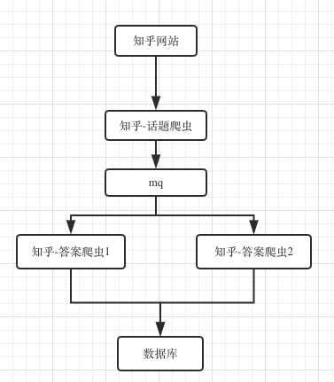

# Rocketmq 的结构以及高可用设计

Create at: 2019-08-11 12:00:00

Author: huanghuapeng@ingbaobei.com

---

## 1. RocketMq 基础知识

### 1.1 Why RocketMq?

Q: 为什么使用 rocketmq,而不使用其他的 mq 呢?

A: 官方给出的回答.

```bash
# Based on our research, with increased queues and virtual topics in use, ActiveMQ IO module reaches a bottleneck. We tried our best to solve this problem through throttling, circuit breaker or degradation, but it did not work well. So we begin to focus on the popular messaging solution Kafka at that time. Unfortunately, Kafka can not meet our requirements especially in terms of low latency and high reliability, see here for details.

大意: 随着队列和topic的增长,ActiveMq遇到了瓶颈.kafka的低延迟和高可靠不达标.

# In this context, we decided to invent a new messaging engine to handle a broader set of use cases, ranging from traditional pub/sub scenarios to high volume real-time zero-loss tolerance transaction system.

大意: 在这样子的前提下,决定去弄一个新的消息引擎来处理消息,从传统的发布/订阅场景到`高容量`,`实时`,`零丢失`事务系统.
```

所以,阿里 ta 们自己一拍脑袋,那为什么不弄一个自己的 mq 出来?(cv 工程师已哭晕在厕所.)

下面是 RocketMq 和 Kafka 以及 ActiveMq 的对比(注意: 站在偏向 RocketMq 的角度的对比)


- ordered message: FIFO(First in first out).
- scheduled message: 定时发送消息.
- batched message: 批量消息(相当 jdbc 的批处理).
- broadcast message: 广播消息.

### 1.2 rocketmq 的结构

### 1.3 pull 与 push 模式

主要有两种方式

| 模式 | 说明                                                                                                            |
| ---- | --------------------------------------------------------------------------------------------------------------- |
| Push | 由 MQ 收到消息后主动调用消费者的新消息通知接口,需要消耗服务器 MQ 宝贵的线程资源,同时消费者只能被动等待消息通知. |
| Pull | 由消费者轮询调用 API 去获取消息,不消耗服务器 MQ 线程,消费者更加主动,虽然消费者的处理逻辑变得稍稍复杂.           |

两种方式的根本区别在于线程消耗问题,由于 MQ 服务器的线程资源相对客户端更加宝贵,Push 方式会占用服务器过多的线程从而难以适应高并发的消息场景.同时当某一消费者离线一段时间再次上线后,大量积压消息处理会消耗大量 MQ 线程从而拖累其它消费者的消息处理,所以 Pull 方式相对来说更好.

---

## 2. 高可用设计

---

## 3. 实际使用案例

### 3.1 lians 的短信消息

### 3.2 爬虫优化

偶尔喜欢刷知乎,所以弄了一个爬虫去爬取知乎的高赞回答.

现在获取到的话题数量

```sql
mysql> select count(1) from t_zhihu_topic;
+----------+
| count(1) |
+----------+
|     7058 |
+----------+
1 row in set (0.00 sec)
```

如果每一个话题下面有 10(如生活下面那种话题,远远大这个数量) 个回答,那么总回答大概在: 7058x10 个.因为知乎存在反爬,同一个 ip 要请求间隔要>10s 才不会被禁用(另一个方案是使用ip代理池).这个可以看出一台服务器的话,爬取这个知乎答案,简直就是锻炼耐性.是的,你没猜错,现在就是一台服务器在爬取. 泪流满面.gif

Q:那么该怎么改进这个爬取的玩意呢?

A:把那些知乎话题下面的回答的 url,放到 mq 里面,在多个服务器上面,开启多个消费端来消费,这样子就能加快爬取的速度了.

version1 架构


version2 架构



注: 爬虫服务器数量和银行卡余额成正比关系.

---

## 4. 注意事项

### 4.1 消息的存储

默认配置只会保存 3 天.

```
Stored messages are will be saved for up to 3 days, and messages that are not consumed for more than 3 days will be deleted.
```

### 4.2 订阅关系一致

**订阅关系一致** [link](https://help.aliyun.com/document_detail/43523.html?spm=a2c4g.11186623.6.605.2a381da95V6B1X)

订阅关系一致指的是同一个消费者 Group ID 下所有 Consumer 实例的处理逻辑必须完全一致。一旦订阅关系不一致，消息消费的逻辑就会混乱，甚至导致消息丢失。消息队列 RocketMQ 里的一个消费者 Group ID 代表一个 Consumer 实例群组。对于大多数分布式应用来说，一个消费者 Group ID 下通常会挂载多个 Consumer 实例。

由于消息队列 RocketMQ 的订阅关系主要由 Topic + Tag 共同组成，因此，保持订阅关系一致意味着同一个消费者 Group ID 下所有的实例需在以下两方面均保持一致：

- 订阅的 Topic 必须一致

- 订阅的 Topic 中的 Tag 必须一致

---

## 5. 鞋在醉后

<u>**每一个不写代码的日子,都是对生命的辜负** </u>. by `弗里德里希·这不是我说的·尼采`

---

## 6. 参考资料

| 文档名称                                 | 连接地址                                                         |
| ---------------------------------------- | ---------------------------------------------------------------- |
| RocketMq 官方文档                        | [link](http://rocketmq.apache.org/docs/quick-start/)             |
| RocketMq 博客                            | [link](https://www.cnblogs.com/qdhxhz/p/11094624.html)           |
| RocketMQ 消息发送的高可用设计            | [link](http://objcoding.com/2019/04/06/rocketmq-fault-strategy/) |
| 分布式开放消息系统(RocketMQ)的原理与实践 | [link](https://www.jianshu.com/p/453c6e7ff81c)                   |
