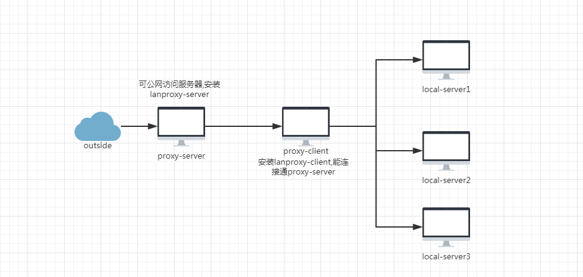
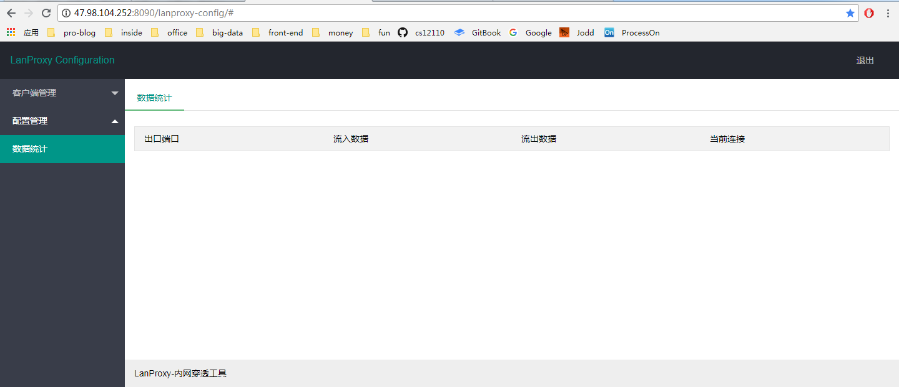
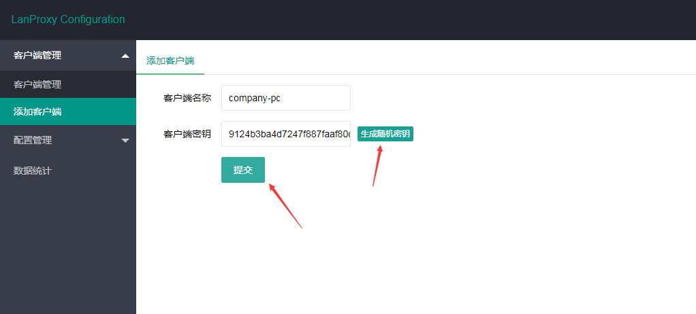
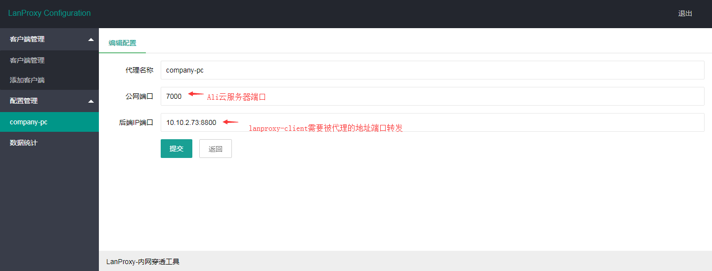
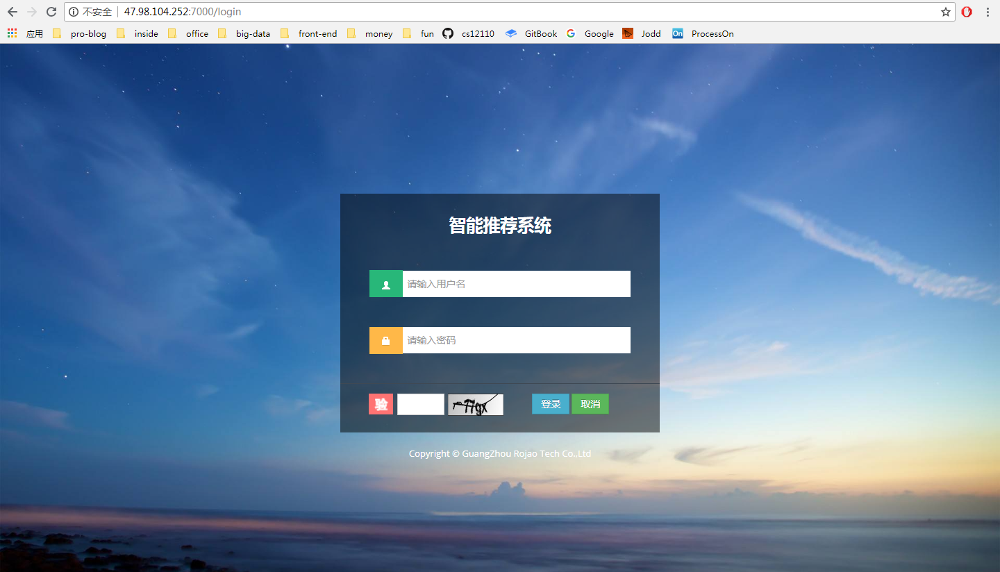

# lanproxy 使用指南

在外网需要使用内网的时候,可以使用 lanproxy 进行代理.

使用 Ali 云服务器: **47.98.104.252**.

lanproxy 下载地址:`https://github.com/ffay/lanproxy/releases`.

Server 端: 架设在可以在互联网访问的服务器上,如阿里云服务器.

Client 端: 架设在内网.



---

## 1. Server 端

安装 Server,只要把压缩包下载到服务器,解压,启动即可.

文件结构如下:

```shell
[root@team-2 proxy-server-20171116]# ls
bin  conf  lib  logs  webpages
[root@team-2 proxy-server-20171116]#
```

### 1.1 修改配置文件

配置文件位置:`conf/config.properties`,下面的三个端口都需要在防火墙中打开.

默认用户和密码都是: **admin**

```properties
server.bind=0.0.0.0
server.port=4900

server.ssl.enable=true
server.ssl.bind=0.0.0.0
server.ssl.port=4993
server.ssl.jksPath=test.jks
server.ssl.keyStorePassword=123456
server.ssl.keyManagerPassword=123456
server.ssl.needsClientAuth=false

# 网页上访问的lanproxy服务器的地址
config.server.bind=0.0.0.0
config.server.port=8090
config.admin.username=admin
config.admin.password=admin
```

### 1.2 开启项目

日志存放在`logs/`目录下.

```shell
[root@team-2 proxy-server-20171116]# bin/startup.sh
Starting the proxy server ...started
PID: 6080
[root@team-2 proxy-server-20171116]#
```

### 1.3 开启防火墙端口

```shell
[root@team-2 conf]# firewall-cmd --add-port=8090/tcp --permanent --zone=public
[root@team-2 conf]# firewall-cmd --add-port=4900/tcp --permanent --zone=public
[root@team-2 conf]# firewall-cmd --add-port=4993/tcp --permanent --zone=public
success
[root@team-2 conf]# systemctl restart firewalld
[root@team-2 conf]# firewall-cmd --list-port
8080/tcp 3306/tcp 9090/tcp 21/tcp 8090/tcp 7000/tcp 4900/tcp 4993/tcp
[root@team-2 conf]#
```

### 1.4 网页访问

访问地址: **http://ip:port/** ip 为服务器 ip,port 为 config.properties 文件里面`config.server.port`的值.



配置客户端,这里生产的密钥很重要,是要在 client 客户端设置的那个值.



添加成功后


配置映射



---

## 3. Client 端

本地下载解压 client 端之后.

文档结构:

```shell
Administrator@QBKF7V9BTMOUJFI MINGW64 ~/Downloads/lanproxy-client/lanproxy-java-client-20171116
$ ls lanproxy-java-client-20171116/
bin/  conf/  lib/  logs/
```

### 3.1 修改客户端配置文件

```properties
# 在proxy server管理页面上生成的key
client.key=3968d345b47f41f1822a18d9dd4bcb29
ssl.enable=false
ssl.jksPath=test.jks
ssl.keyStorePassword=123456

# 阿里云服务器地址
server.host=47.98.104.252

#default ssl port is 4993
server.port=4900
```

### 3.2 开启客户端

要记得打开服务器的相关端口,如`4900`,`4993`,`8090`等端口.

**要注意日志文件是否有异常出现.**

```shell
Administrator@QBKF7V9BTMOUJFI MINGW64 ~/Downloads/lanproxy-client/lanproxy-java-client-20171116/lanproxy-java-client-20171116
$ bin/startup.sh
Starting the proxy client ...started
PID:

Administrator@QBKF7V9BTMOUJFI MINGW64 ~/Downloads/lanproxy-client/lanproxy-java-client-20171116/lanproxy-java-client-20171116
$
```

### 3.3 测试

本地开启智能推荐项目,保证 client 的服务器能连接.


**使用代理连接**

全部开启成功之后,可以通过阿里云访问内网的部署的项目了,一颗赛艇.



这样子,就代理成功了.

### 3.4 代理 ssh

哇咔咔,这个才是重点.

解压:`lanproxy-client-linux-amd64-20171128.tar.gz`,得到`client_linux_amd64`脚本

启动格式命令如下:

```properties
nohup ./client_linux_amd64 -s SERVER_IP -p SERVER_SSL_PORT -k KEY_OF_PROXY -ssl true &
```

启动 client 端

```shell
hadoop233:/opt/team2/soft/lanproxy-client # nohup ./client_linux_amd64 -s 47.98.104.252 -p 4993 -k 9124b3ba4d7247f887faaf80c3a7905c -ssl true &
[1] 24257
hadoop233:/opt/team2/soft/lanproxy-client # nohup: ignoring input and appending output to `nohup.out'

hadoop233:/opt/team2/soft/lanproxy-client # cat nohup.out
2018/06/21 11:36:28 lanproxy - help you expose a local server behind a NAT or firewall to the internet
2018/06/21 11:36:28 client key: 9124b3ba4d7247f887faaf80c3a7905c
2018/06/21 11:36:28 server addr: 47.98.104.252
2018/06/21 11:36:28 server port: 4993
2018/06/21 11:36:28 enable ssl: true
2018/06/21 11:36:28 ssl cer path: certificate path is null, skip verify certificate
2018/06/21 11:36:28 init connection pool, len 0, cap 100
2018/06/21 11:36:28 start heartbeat: &{0 0 false <nil> 0xc420031500 [] <nil>}
2018/06/21 11:36:28 start listen cmd message: {0xc420054400 0xc4200583c0 9124b3ba4d7247f887faaf80c3a7905c 0xc42001e8a0}
2018/06/21 11:36:28 connSuccess, clientkey: 9124b3ba4d7247f887faaf80c3a7905c
hadoop233:/opt/team2/soft/lanproxy-client #
```

网页配置如下,**7002 端口需要在 lanproxy-server 防火墙上打开.**


使用 xshell 登录


输入用户和密码后

```shell
Last login: Wed Jun 20 23:28:40 2018 from 10.10.2.233
[root@dev-1 ~]# ip addr
1: lo: <LOOPBACK,UP,LOWER_UP> mtu 65536 qdisc noqueue state UNKNOWN qlen 1
    link/loopback 00:00:00:00:00:00 brd 00:00:00:00:00:00
    inet 127.0.0.1/8 scope host lo
       valid_lft forever preferred_lft forever
    inet6 ::1/128 scope host
       valid_lft forever preferred_lft forever
2: ens33: <BROADCAST,MULTICAST,UP,LOWER_UP> mtu 1500 qdisc pfifo_fast state UP qlen 1000
    link/ether 00:0c:29:42:68:f1 brd ff:ff:ff:ff:ff:ff
    inet 10.33.1.110/32 brd 10.33.1.110 scope global ens33
       valid_lft forever preferred_lft forever
    inet6 fe80::4628:ac37:5337:e555/64 scope link
       valid_lft forever preferred_lft forever
[root@dev-1 ~]#
```

这样子就成功代理, 贼开心.

---

## 4. 相关命令

**普通端口连接**

```shell
# mac 64位
nohup ./client_darwin_amd64 -s SERVER_IP -p SERVER_PORT -k CLIENT_KEY &

# linux 64位
nohup ./client_linux_amd64 -s SERVER_IP -p SERVER_PORT -k CLIENT_KEY &

# windows 64 位
./client_windows_amd64.exe -s SERVER_IP -p SERVER_PORT -k CLIENT_KEY
```

**SSL 端口连接**(服务器连接)

```shell
# mac 64位
nohup ./client_darwin_amd64 -s SERVER_IP -p SERVER_SSL_PORT -k CLIENT_KEY -ssl true &

# linux 64位
nohup ./client_linux_amd64 -s SERVER_IP -p SERVER_SSL_PORT -k CLIENT_KEY -ssl true &

# windows 64 位
./client_windows_amd64.exe -s SERVER_IP -p SERVER_SSL_PORT -k CLIENT_KEY -ssl true
```

---

## 5. 参考资料

a. [使用 lanproxy 进行内网穿透](https://www.jianshu.com/p/6482ac354d34)

b. [github 地址](https://github.com/ffay/lanproxy)
