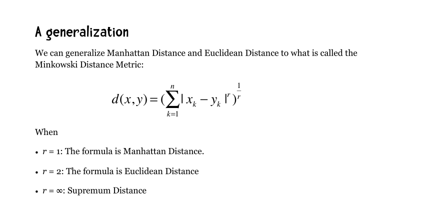

# 数据挖掘笔记

最好是自己根据那些例子写一遍,然后理解那些东西.`进度: 70/395`

书籍地址: [A Programmer's Guide to Data Mining](http://guidetodatamining.com/)

---

## 基础算法

本章节主要用于第二章节的算法说明的简单记录.

各种距离都是为了找出`nearest`的`neighbor`,找出相似度最高的用户/物品.

### 1. 曼哈顿距离和欧几里得距离

书本: `Manhattan Distance and Euclidean Distance work best when there are no missing values`

**曼哈顿距离和欧几里得距离都适用于,两个维度没有缺失值的情况下.**

下面的公式里面

- 当 r=1 时,为曼哈顿距离计算公式.
- 当 r=2 时,为欧几里距离计算公式(勾股定理).
- 当 r=3 时,为多维距离计算公式.

**从公式可以看出来,曼哈顿距离越大则欧几里得距离也越大,距离越大相似度越低**

### 2. 皮尔逊相关系数

公式经过转换后,如下图所示:

书本: `It ranges between -1 and 1 inclusive. 1 indicates perfect agreement. -1 indicates perfect disagreement.`

**主要考虑数据的离散程度.值越接近于 1 时,相似度越高,越接近-1 时,越不相似.**

### 3. 余弦相似度

书本: `which is very popular in text mining but also used in collaborative filtering—cosine similarity`

**该相似度是非常流行的文本挖掘算法,比如全文检索之类.**

公式如下:

书本:`The cosine similarity rating ranges from 1 indicated perfect similarity to -1 indicate perfect negative similarity`

**值越接近于 1 时,相似度越高,越接近-1 时,越不相似.**

Q: 在电影推荐里面,我们根据电影的分类(比如喜剧,动作,爱情,剧情之类的)做余弦相似度计算.怎么做这个呢?

A: 构建一个稀疏的矩阵,每部电影包含了所有的分类,自己拥有的分类赋值为 1,没有的赋值为 0,然后交付给余弦相似度计算.

### 4. 计算算法的选取

Attention: **这个才是最重要的.**

- 如果数据存在"分数膨胀"问题,就使用`皮尔逊相关系数`.
- 如果数据比较"密集",变量之间基本都存在公有值,且这些距离数据是非常重要的,那就使用`欧几里得`或`曼哈顿距离`.
- 如果数据比较稀松,可以使用`余弦相似度算法`

分数膨胀:只要要求人类的一个群体去评价另一个群体的表现,分数膨胀就会出现.[link](https://baike.baidu.com/item/分数膨胀/1948048)

---

## 协同过滤

**Explicit ratings**: 明确的给出了评分,如知乎里面的 upvote/downvote

**Implicit Ratings**: 非明确评分,通过观察用户行为获得,如点击了多少次啦,建立用户画像.

用户画像的建立例子:`After observing what a user clicks on for a few weeks you can imagine that we could develop a reasonable profile of that user—she doesn't like sports but seems to like technology news. If the user clicks on the article “Fastest Way to Lose Weight Discovered by Professional Trainers” and the article “Slow and Steady: How to lose weight and keep it off” perhaps she wishes to lose weight. If she clicks on the iPhone ad, she perhaps has an interest in that product. (By the way, the term used when a user clicks on an ad is called 'click through'.)`

---

## 参考资料

a. [数据挖掘指南官网](http://guidetodatamining.com/)

b. [数据挖掘指南中文版](https://dataminingguide.books.yourtion.com)
